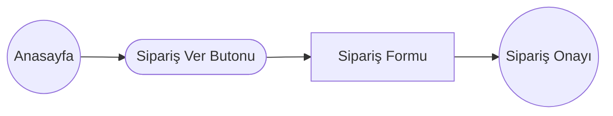
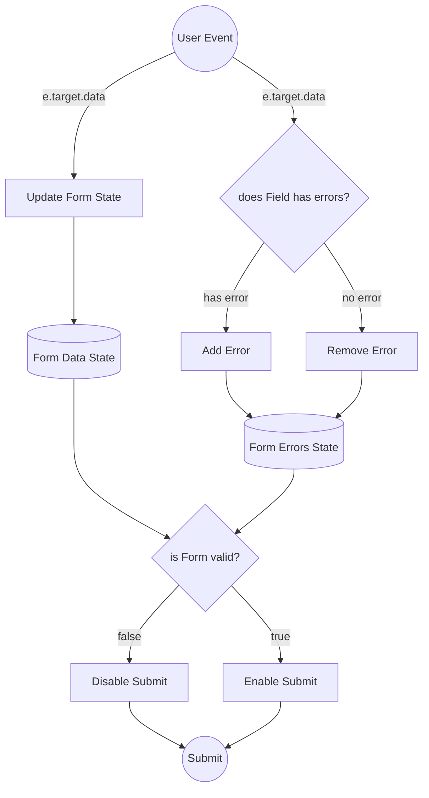
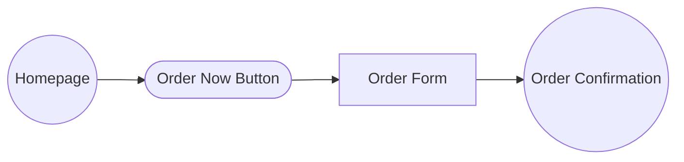

#TR
# 🍕 Teknolojik Yemekler —  Yazılım Geliştiriciler için Yemek Sipariş Platformu ( E2E Testli & Dinamik )

**Hey Sen**, bilgisayar başında karnı acıkan yazılım geliştirici! **Karnın mı Acıktı?** O zamannn ne duruyorsun? Pizza siparişini bu websitesinden verebilirsin!  
**Teknolojik Yemekler**, modern frontend mimarisi prensipleriyle tasarlanmış, **en dar telefon ekranından masaüstüne kadar kusursuz responsive deneyim sunan**, kullanıcı davranışlarına anlık tepki veren, uçtan uca test edilmiş (**E2E Cypress**) ve yüksek performanslı bir **React Single Page Application (SPA)** projesidir.

Bu proje yalnızca bir e-ticaret arayüzü sunmakla kalmaz; form durum yönetiminden (**State Management**), asenkron API iletişimine, **Edge-Case** (sınır durumu) korumalarından, **React 18 Strict Mode** yarış koşullarının (`Race Conditions`) engellenmesine kadar derin bir frontend mühendisliği barındırır.

---

## 🌐 Canlı Demo & Otomatik Test Raporları

* 🚀 **Canlı Uygulama (Live Demo):** `[BURAYA VERCEL LİNKİNİ EKLEYİN]`
* 🧪 **Test Kapsamı:** 100% Uçtan Uca Cypress Senaryoları Başarılı (Form, Navigasyon, Ağ Yakalama & Fiyat Motoru)

---

## Temsili Veri Akış Diyagramları

### Routes



### Sipariş Formu Veri Akışı ve Validasyon Motoru



---

## 📱 Her Ekran ve Telefon Boyutu İçin %100 Responsive Mimari

Uygulama, sadece standart cihazlar için değil; en dar ekranlı mobil cihazlardan (örn: 320px iPhone SE) geniş ekranlı tablet ve masaüstü monitörlere kadar **her kırılma noktasında (Breakpoint) piksel kusursuzluğu** hedeflenerek tasarlanmıştır.

### Mobil Tasarımda Uygulanan Mühendislik Çözümleri:
* **📐 Akışkan Tipografi ve Esnek Boyutlandırma (`clamp()` & `vw/vh`)** 
* **🔀 Dinamik Grid ve Flexbox Dönüşümleri** 
* **🎨 Responsive Arka Plan Katmanları (`Gradient Masking`)** 
  
---

## 🏗️ Mimari Felsefe ve Kullanıcı Deneyimi (Deep Dive)

Uygulama üzerinde bir kullanıcının attığı her adım, arka planda belirli React kancalarını (`Hooks`), validasyon motorlarını ve asenkron HTTP süreçlerini tetikler. İşte adım adım sistemin çalışma mekanizması:

### 1. Karşılama ve Dinamik Yönlendirme (Anasayfa)
* **Kullanıcı Ne Yaşar?** Kullanıcı, yüksek çözünürlüklü ve tamamen mobil uyumlu bir karşılama ekranıyla karşılaşır. Sayfayı yenilemeden tek tıkla sipariş motoruna geçiş yapar.
* **Arkaplanda Hangi Fonksiyonlar Çalışır?**
  * **`useHistory` Hook & SPA Yönlendirmesi:** "ACIKTIM" butonuna tıklandığında `handleSiparisGecis` metodu tetiklenir. Tarayıcının varsayılan sayfa yenileme davranışı `event.preventDefault()` ile engellenir ve `history.push("/PizzaSiparisi")` metodu sayesinde **React Virtual DOM** üzerinden sayfa saniyeler içinde (yüklenmeksinizin) render edilir.
  * **Dinamik CSS (`styled-components`):** Görsel tasarım, harici `.css` dosyaları yerine tam izole bileşen mantığıyla çalışır. Ekrana göre arka plan katmanları (`linear-gradient` & `clamp()` fonksiyonları) dinamik olarak yeniden hesaplanır.

### 2. Akıllı Sipariş Motoru & Gerçek Zamanlı Validasyon (`SiparisFormu.jsx`)
Sipariş formu, projenin en yoğun iş mantığına (**Business Logic**) sahip katmanıdır.

* **A) Kontrollü Form Yönetimi (`useForm`):**
  * Form verilerini klasik DOM manipulation yerine, `react-hook-form` kütüphanesinin **Uncontrolled Component** performansı ile yönetiriz.
  * Form validasyon modu `mode: "onChange"` olarak kurgulanmıştır. Kullanıcı klavyeye her dokunduğunda veya bir malzemeye tıkladığında `isValid` durumu anlık hesaplanır ve sipariş butonu bu duruma göre aktif/pasif (`disabled`) olur.

* **B) Malzeme Seçimi & Sınır Koruma Algoritması (Edge-Case Handling):**
  * **Kural:** Kullanıcı en az 4, en fazla 10 ek malzeme seçmelidir.
  * **Çalışan Mantık:** `watch("malzemeler")` metodu ile kullanıcının seçim dizisi sürekli dinlenir. Eğer kullanıcı tam 10 malzemeye ulaşırsa, ekrandaki 11. malzemenin `<input type="checkbox" />` elemanı şu mantıksal kontrolle anında kilitlenir:
    ```javascript
    disabled={seciliMalzemeler.length >= 10 && !seciliMalzemeler.includes(malzeme)}
    ```
    Bu sayede kullanıcının hatalı veri gönderme ihtimali arayüz seviyesinde bloklanır.

* **C) Dinamik Fiyat Hesaplama Motoru (`State Derivation`):**
  * Malzeme seçildikçe veya pizza adeti değiştirildikçe fiyat matematiksel olarak yeniden üretilir. Ekstra bir `useEffect` tetikleyip performansı düşürmek yerine doğrudan state türetme prensibi uygulanır:
    $$\text{Toplam Tutar} = (\text{Base Price} + (\text{Seçilen Malzeme Sayısı} \times 5₺)) \times \text{Adet}$$

### 3. Asenkron API İletişimi ve Ağ Güvenliği (`onSubmit`)
* **Kullanıcı Ne Yaşar?** Form eksiksiz doldurulup "SİPARİŞ VER" butonuna basıldığı an paket hazırlanır, sunucuya iletilir ve kullanıcı anında onay ekranına taşınır.
* **Arkaplanda Hangi Fonksiyonlar Çalışır?**
  * **Payload Paketleme:** Arayüzdeki dağınık form verileri, backend servisinin beklediği standart JSON şemasında (`payload`) tek bir nesne haline getirilir.
  * **HTTP POST & Header Güvenliği:** `axios.post()` metodu ile `https://reqres.in/api/pizza` uç noktasına istek atılırken, API'nin zorunlu tuttuğu yetkilendirme başlığı (`x-api-key`) güvenli bir şekilde `headers` bloğunda iletilir.
  * **Durum Taşımalı Yönlendirme:** Sunucudan `201 Created` yanıtı geldiği an, kullanıcı `history.push({ pathname: "/Onay", state: { siparisBasarili: true } })` metoduyla onay sayfasına yönlendirilir. Veri, URL'i kirletmeden tarayıcının bellek durumunda (`Router State`) güvenle taşınır.

### 4. Başarı Ekranı & React 18 Strict Mode Koruması (`SiparisOnayi.jsx`)
* **Arkaplanda Hangi Fonksiyonlar Çalışır?**
  * **Race-Condition Koruması (`useRef`):** React 18 geliştirme ortamında `useEffect` kancaları çift çalışır (double-mount). Sayfa açıldığında Toast bildiriminin ekrana iki kez patlamasını engellemek için `isToasted` adında bir `useRef` referansı bayrak (`flag`) olarak kullanılır.
  * **Bellek Temizliği (`history.replace`):** Toast gösterildikten hemen sonra `history.replace` ile yönlendirme durumu (`state`) temizlenir. Böylece kullanıcı sayfayı yenilediğinde (`F5`) gereksiz yere tekrar başarılı bildirimi görmez.

---

## 🧪 Uçtan Uca (E2E) Kalite ve Cypress Test Mühendisliği

Bir frontend projesinin güvenilirliği, yazdığı otomatik testlerle ölçülür. Bu projede elementler kırılgan **CSS class'ları** veya **ID'leri** yerine, endüstri standardı olan izole **`data-cy`** etiketleriyle yakalanmıştır.

### Öne Çıkan Cypress Senaryoları:
1. **Ağ Yakalama (Network Interception):** `cy.intercept('POST', '.../api/pizza').as('siparisGonder')` metodu kullanılarak gerçek bir kullanıcının sipariş anında attığı HTTP isteği havada yakalanır. Dönen yanıtın durum kodunun tam olarak **`201 Created`** olduğu matematiksel olarak kanıtlanır.
2. **Negatif Validasyon Testleri:** İsim alanı 5 karakterden az girildiğinde veya 4'ten az malzeme seçildiğinde `submit` butonunun `be.disabled` (tıklanamaz) kaldığı test edilir.
3. **Sınır Testi (Boundary Testing):** Döngü (`forEach`) ile tam 10 malzeme seçtirilir ve 11. malzemenin otomatik olarak kilitlendiği (`should('be.disabled')`) doğrulanır.

---

## 🛠️ Teknoloji Yığını (Tech Stack)

| Kütüphane / Araç | Versiyon | Kullanım Amacı |
| :--- | :--- | :--- |
| **React** | `v18.x` | Bileşen tabanlı modüler UI ve Virtual DOM performansı |
| **Vite** | `v5.x` | ES-Module tabanlı süper hızlı derleme ve HMR (Hot Module Replacement) |
| **Styled-Components** | `v6.x` | CSS-in-JS yaklaşımı, `ThemeProvider` ile merkezi tema ve `GlobalStyles` resetleme |
| **React-Hook-Form** | `v7.x` | Re-render sayısını minimize eden, performanslı form validasyon motoru |
| **React-Router-Dom** | `v5.x` | Sayfalar arası dinamik durum (`state`) taşıma ve kesintisiz SPA gezinti |
| **Axios** | `v1.x` | HTTP istemcisi, API istekleri ve Header yönetimi |
| **React-Toastify** | `v9.x` | Asenkron işlem sonuçlarında anlık bildirim animasyonları |
| **Cypress** | `v13.x` | Uçtan uca (E2E) form, sayaç, navigasyon ve ağ testi otomasyonu |

---

## 🚀 Yerel Kurulum ve Test Çalıştırma Kılavuzu

Projeyi yerel makinenizde çalıştırmak ve mimariyi incelemek için aşağıdaki komut satırı adımlarını uygulayabilirsiniz:

```bash
# 1. Proje reposunu lokal makinenize klonlayın
git clone [https://github.com/](https://github.com/)[KULLANICI_ADINIZ]/teknolojik-yemekler.git

# 2. Proje klasörünün içine girin
cd teknolojik-yemekler

# 3. Gerekli Node.js paketlerini yükleyin
npm install

# 4. Geliştirme sunucusunu başlatın
npm run dev


---

#EN

# 🍕 Teknolojik Yemekler — E2E Tested & Dynamic Food Ordering Platform for Software Developers

**Hey You**, the software developer whose stomach is rumbling right in front of the computer! **Are you hungry?** Then what are you waiting for? You can order your pizza right from this website!  

**Teknolojik Yemekler** is a high-performance **React Single Page Application (SPA)** project, designed with modern frontend architecture principles, providing a **flawless responsive experience from the narrowest phone screen to the desktop**, reacting instantly to user behaviors, and completely tested end-to-end (**E2E Cypress**).

This project does not only offer an e-commerce interface; it embodies deep frontend engineering, ranging from form state management (**State Management**) and asynchronous API communication to **Edge-Case** (boundary state) protections and preventing **React 18 Strict Mode** race conditions (`Race Conditions`).

---

## 🌐 Live Demo & Automated Test Reports

* 🚀 **Live Application (Live Demo):** `[ADD VERCEL LINK HERE]`
* 🧪 **Test Coverage:** 100% End-to-End Cypress Scenarios Successful (Form, Navigation, Network Interception & Price Engine)

---

## Representative Data Flow Diagrams

### Routes


### Order Form Data Flow and Validation Engine

---

## 📱 100% Responsive Architecture For Every Screen and Phone Size

The application is designed targeting pixel perfection at every breakpoint, not just for standard devices but ranging from the narrowest mobile devices (e.g., 320px iPhone SE) to wide-screen tablets and desktop monitors.

### Engineering Solutions Applied in Mobile Design:
* **📐 Fluid Typography and Flexible Sizing:** Implemented using `clamp()` and `vw/vh` units.
* **🔀 Dynamic Grid and Flexbox Transformations:** Seamless structure shifts across viewport sizes.
* **🎨 Responsive Background Layers:** Utilizes gradient masking techniques for optimal visual contrast.

---

## 🏗️ Architectural Philosophy and User Experience (Deep Dive)

Every step taken by a user on the application triggers specific React hooks, validation engines, and asynchronous HTTP processes in the background. Here is the working mechanism of the system step-by-step:

### 1. Welcome and Dynamic Routing (Homepage)
* **What Does the User Experience?** The user encounters a high-resolution and fully mobile-responsive welcome screen. They transition to the order engine with a single click without refreshing the page.
* **Which Functions Run in the Background?**
  * **`useHistory` Hook & SPA Routing:** When the "ACIKTIM" button is clicked, the `handleSiparisGecis` method is triggered. The browser's default page refresh behavior is prevented using `event.preventDefault()`, and thanks to the `history.push("/PizzaSiparisi")` method, the page is rendered over the React Virtual DOM in seconds (without any loading time).
  * **Dynamic CSS (`styled-components`):** The visual design operates with fully isolated component logic instead of external `.css` files. Background layers are dynamically recalculated based on the screen (`linear-gradient` & `clamp()` functions).

### 2. Smart Order Engine & Real-Time Validation (`SiparisFormu.jsx`)
The order form is the layer possessing the most intensive business logic of the project.

* **A) Controlled Form Management (`useForm`):**
  * We manage form data using the Uncontrolled Component performance of the `react-hook-form` library, instead of classic DOM manipulation.
  * The form validation mode is structured as `mode: "onChange"`. Every time the user types on the keyboard or clicks on an ingredient, the `isValid` state is calculated instantly, and the order button becomes active/passive (`disabled`) based on this status.

* **B) Ingredient Selection & Boundary Protection Algorithm (Edge-Case Handling):**
  * **Rule:** The user must select at least 4 and at most 10 additional ingredients.
  * **Working Logic:** The user's selection array is constantly listened to via the `watch("malzemeler")` method. If the user reaches exactly 10 ingredients, the `<input type="checkbox" />` element of the 11th ingredient on the screen is instantly locked with the following logical control:
    ```jsx
    disabled={seciliMalzemeler.length >= 10 && !seciliMalzemeler.includes(malzeme)}
    ```
    In this way, the possibility of the user sending erroneous data is blocked at the interface level.

* **C) Dynamic Price Calculation Engine (State Derivation):**
  As ingredients are selected or the pizza quantity is changed, the price is mathematically generated anew. Instead of triggering an extra `useEffect` and reducing performance, a direct state derivation principle is applied:
  $$\text{Total Amount} = (\text{Base Price} + (\text{Number of Selected Ingredients} \times 5₺)) \times \text{Quantity}$$

### 3. Asynchronous API Communication and Network Security (`onSubmit`)
* **What Does the User Experience?** The moment the form is fully filled out and the "SİPARİŞ VER" button is pressed, the payload is prepared, transmitted to the server, and the user is instantly moved to the confirmation screen.
* **Which Functions Run in the Background?**
  * **Payload Packaging:** The scattered form data in the interface is consolidated into a single object under the standard JSON schema (`payload`) expected by the backend service.
  * **HTTP POST & Header Security:** While sending a request to the `https://reqres.in/api/pizza` endpoint using the `axios.post()` method, the authorization header (`x-api-key`) required by the API is securely transmitted in the `headers` block.
  * **Stateful Routing:** The moment a `201 Created` response is received from the server, the user is redirected to the confirmation page using the `history.push({ pathname: "/Onay", state: { siparisBasarili: true } })` method. The data is securely carried inside the browser's history state (`Router State`) without cluttering the URL.

### 4. Success Screen & React 18 Strict Mode Protection (`SiparisOnayi.jsx`)
* **Which Functions Run in the Background?**
  * **Race-Condition Protection (`useRef`):** In the React 18 development environment, `useEffect` hooks run twice (double-mount). To prevent the Toast notification from triggering twice on the screen when the page opens, a `useRef` reference named `isToasted` is used as a flag.
  * **Memory Cleanup (`history.replace`):** Immediately after the Toast is displayed, the routing state (`state`) is cleared using `history.replace`. Thus, the user does not unnecessarily see the success notification again when they refresh the page (`F5`).

---

## 🧪 End-to-End (E2E) Quality and Cypress Test Engineering

The reliability of a frontend project is measured by the automated tests written for it. In this project, instead of fragile CSS classes or IDs, elements are captured using the industry-standard isolated `data-cy` attributes.

### Featured Cypress Scenarios:
* **Network Interception:** Using the `cy.intercept('POST', '.../api/pizza').as('siparisGonder')` method, the HTTP request sent by a real user during order placement is captured in mid-air. It mathematically proves that the status code of the returned response is exactly `201 Created`.
* **Negative Validation Tests:** Tests that the submit button remains `be.disabled` (unclickable) when the name field is entered with fewer than 5 characters or when fewer than 4 ingredients are selected.
* **Boundary Testing:** Exactly 10 ingredients are selected via a loop (`forEach`), and it is verified that the 11th ingredient is automatically locked (`should('be.disabled')`).

---

## 🛠️ Tech Stack

| Library / Tool | Version | Purpose of Use |
| :--- | :--- | :--- |
| **React** | `v18.x` | Component-based modular UI and Virtual DOM performance |
| **Vite** | `v5.x` | ES-Module based super-fast bundling and HMR (Hot Module Replacement) |
| **Styled-Components** | `v6.x` | CSS-in-JS approach, centralized theming with `ThemeProvider`, and `GlobalStyles` reset |
| **React-Hook-Form** | `v7.x` | Performance-optimized form validation engine minimizing re-renders |
| **React-Router-Dom** | `v5.x` | Dynamic state transfer between pages and seamless SPA navigation |
| **Axios** | `v1.x` | HTTP client, API requests, and Header management |
| **React-Toastify** | `v9.x` | Real-time notification animations for asynchronous operations |
| **Cypress** | `v13.x` | End-to-end (E2E) form, counter, navigation, and network test automation |

---

## 🚀 Local Installation and Test Run Guide

You can follow the command-line steps below to run the project on your local machine and inspect the architecture:

```bash
# 1. Clone the project repository to your local machine
git clone [https://github.com/](https://github.com/)[YOUR_USERNAME]/teknolojik-yemekler.git

# 2. Navigate into the project directory
cd teknolojik-yemekler

# 3. Install the required Node.js packages
npm install

# 4. Start the development server
npm run dev
