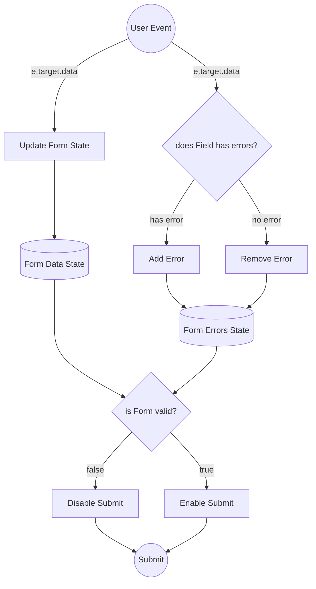

# 🍕 Teknolojik Yemekler —  Yaızlım Geliştiriciler için Yemek Sipariş Platformu ( E2E Testli & Dinamik )

**Hey Sen**, bilgisayar başında karnı acıkan yazılım geliştirici! **Karnın mı Acıktı?** O zamannn ne duruyorsun? Pizza siparişini bu websitesinden verebilirsin!  
**Teknolojik Yemekler**, modern frontend mimarisi prensipleriyle tasarlanmış, **en dar telefon ekranından masaüstüne kadar kusursuz responsive deneyim sunan**, kullanıcı davranışlarına anlık tepki veren, uçtan uca test edilmiş (**E2E Cypress**) ve yüksek performanslı bir **React Single Page Application (SPA)** projesidir.

Bu proje yalnızca bir e-ticaret arayüzü sunmakla kalmaz; form durum yönetiminden (**State Management**), asenkron API iletişimine, **Edge-Case** (sınır durumu) korumalarından, **React 18 Strict Mode** yarış koşullarının (`Race Conditions`) engellenmesine kadar derin bir frontend mühendisliği barındırır.

---

## 🌐 Canlı Demo & Otomatik Test Raporları

* 🚀 **Canlı Uygulama (Live Demo):** `[BURAYA VERCEL LİNKİNİ EKLEYİN]`
* 🧪 **Test Kapsamı:** 100% Uçtan Uca Cypress Senaryoları Başarılı (Form, Navigasyon, Ağ Yakalama & Fiyat Motoru)

---

## Temsili Veri Akış Diyagramları

### Routes


### Sipariş Formu Veri Akışı ve Validasyon Motoru



---

## 📱 Her Ekran ve Telefon Boyutu İçin %100 Responsive Mimari

Uygulama, sadece standart cihazlar için değil; en dar ekranlı mobil cihazlardan (örn: 320px iPhone SE) geniş ekranlı tablet ve masaüstü monitörlere kadar **her kırılma noktasında (Breakpoint) piksel kusursuzluğu** hedeflenerek tasarlanmıştır.

### Mobil Tasarımda Uygulanan Mühendislik Çözümleri:
* **📐 Akışkan Tipografi ve Esnek Boyutlandırma (`clamp()` & `vw/vh`)** 
* **🔀 Dinamik Grid ve Flexbox Dönüşümleri** 
* **🎨 Responsive Arka Plan Katmanları (`Gradient Masking`)** 
  
---

## 🏗️ Mimari Felsefe ve Kullanıcı Deneyimi (Deep Dive)

Uygulama üzerinde bir kullanıcının attığı her adım, arka planda belirli React kancalarını (`Hooks`), validasyon motorlarını ve asenkron HTTP süreçlerini tetikler. İşte adım adım sistemin çalışma mekanizması:

### 1. Karşılama ve Dinamik Yönlendirme (Anasayfa)
* **Kullanıcı Ne Yaşar?** Kullanıcı, yüksek çözünürlüklü ve tamamen mobil uyumlu bir karşılama ekranıyla karşılaşır. Sayfayı yenilemeden tek tıkla sipariş motoruna geçiş yapar.
* **Arkaplanda Hangi Fonksiyonlar Çalışır?**
  * **`useHistory` Hook & SPA Yönlendirmesi:** "ACIKTIM" butonuna tıklandığında `handleSiparisGecis` metodu tetiklenir. Tarayıcının varsayılan sayfa yenileme davranışı `event.preventDefault()` ile engellenir ve `history.push("/PizzaSiparisi")` metodu sayesinde **React Virtual DOM** üzerinden sayfa saniyeler içinde (yüklenmeksinizin) render edilir.
  * **Dinamik CSS (`styled-components`):** Görsel tasarım, harici `.css` dosyaları yerine tam izole bileşen mantığıyla çalışır. Ekrana göre arka plan katmanları (`linear-gradient` & `clamp()` fonksiyonları) dinamik olarak yeniden hesaplanır.

### 2. Akıllı Sipariş Motoru & Gerçek Zamanlı Validasyon (`SiparisFormu.jsx`)
Sipariş formu, projenin en yoğun iş mantığına (**Business Logic**) sahip katmanıdır.

* **A) Kontrollü Form Yönetimi (`useForm`):**
  * Form verilerini klasik DOM manipulation yerine, `react-hook-form` kütüphanesinin **Uncontrolled Component** performansı ile yönetiriz.
  * Form validasyon modu `mode: "onChange"` olarak kurgulanmıştır. Kullanıcı klavyeye her dokunduğunda veya bir malzemeye tıkladığında `isValid` durumu anlık hesaplanır ve sipariş butonu bu duruma göre aktif/pasif (`disabled`) olur.

* **B) Malzeme Seçimi & Sınır Koruma Algoritması (Edge-Case Handling):**
  * **Kural:** Kullanıcı en az 4, en fazla 10 ek malzeme seçmelidir.
  * **Çalışan Mantık:** `watch("malzemeler")` metodu ile kullanıcının seçim dizisi sürekli dinlenir. Eğer kullanıcı tam 10 malzemeye ulaşırsa, ekrandaki 11. malzemenin `<input type="checkbox" />` elemanı şu mantıksal kontrolle anında kilitlenir:
    ```javascript
    disabled={seciliMalzemeler.length >= 10 && !seciliMalzemeler.includes(malzeme)}
    ```
    Bu sayede kullanıcının hatalı veri gönderme ihtimali arayüz seviyesinde bloklanır.

* **C) Dinamik Fiyat Hesaplama Motoru (`State Derivation`):**
  * Malzeme seçildikçe veya pizza adeti değiştirildikçe fiyat matematiksel olarak yeniden üretilir. Ekstra bir `useEffect` tetikleyip performansı düşürmek yerine doğrudan state türetme prensibi uygulanır:
    $$\text{Toplam Tutar} = (\text{Base Price} + (\text{Seçilen Malzeme Sayısı} \times 5₺)) \times \text{Adet}$$

### 3. Asenkron API İletişimi ve Ağ Güvenliği (`onSubmit`)
* **Kullanıcı Ne Yaşar?** Form eksiksiz doldurulup "SİPARİŞ VER" butonuna basıldığı an paket hazırlanır, sunucuya iletilir ve kullanıcı anında onay ekranına taşınır.
* **Arkaplanda Hangi Fonksiyonlar Çalışır?**
  * **Payload Paketleme:** Arayüzdeki dağınık form verileri, backend servisinin beklediği standart JSON şemasında (`payload`) tek bir nesne haline getirilir.
  * **HTTP POST & Header Güvenliği:** `axios.post()` metodu ile `https://reqres.in/api/pizza` uç noktasına istek atılırken, API'nin zorunlu tuttuğu yetkilendirme başlığı (`x-api-key`) güvenli bir şekilde `headers` bloğunda iletilir.
  * **Durum Taşımalı Yönlendirme:** Sunucudan `201 Created` yanıtı geldiği an, kullanıcı `history.push({ pathname: "/Onay", state: { siparisBasarili: true } })` metoduyla onay sayfasına yönlendirilir. Veri, URL'i kirletmeden tarayıcının bellek durumunda (`Router State`) güvenle taşınır.

### 4. Başarı Ekranı & React 18 Strict Mode Koruması (`SiparisOnayi.jsx`)
* **Arkaplanda Hangi Fonksiyonlar Çalışır?**
  * **Race-Condition Koruması (`useRef`):** React 18 geliştirme ortamında `useEffect` kancaları çift çalışır (double-mount). Sayfa açıldığında Toast bildiriminin ekrana iki kez patlamasını engellemek için `isToasted` adında bir `useRef` referansı bayrak (`flag`) olarak kullanılır.
  * **Bellek Temizliği (`history.replace`):** Toast gösterildikten hemen sonra `history.replace` ile yönlendirme durumu (`state`) temizlenir. Böylece kullanıcı sayfayı yenilediğinde (`F5`) gereksiz yere tekrar başarılı bildirimi görmez.

---

## 🧪 Uçtan Uca (E2E) Kalite ve Cypress Test Mühendisliği

Bir frontend projesinin güvenilirliği, yazdığı otomatik testlerle ölçülür. Bu projede elementler kırılgan **CSS class'ları** veya **ID'leri** yerine, endüstri standardı olan izole **`data-cy`** etiketleriyle yakalanmıştır.

### Öne Çıkan Cypress Senaryoları:
1. **Ağ Yakalama (Network Interception):** `cy.intercept('POST', '.../api/pizza').as('siparisGonder')` metodu kullanılarak gerçek bir kullanıcının sipariş anında attığı HTTP isteği havada yakalanır. Dönen yanıtın durum kodunun tam olarak **`201 Created`** olduğu matematiksel olarak kanıtlanır.
2. **Negatif Validasyon Testleri:** İsim alanı 5 karakterden az girildiğinde veya 4'ten az malzeme seçildiğinde `submit` butonunun `be.disabled` (tıklanamaz) kaldığı test edilir.
3. **Sınır Testi (Boundary Testing):** Döngü (`forEach`) ile tam 10 malzeme seçtirilir ve 11. malzemenin otomatik olarak kilitlendiği (`should('be.disabled')`) doğrulanır.

---

## 🛠️ Teknoloji Yığını (Tech Stack)

| Kütüphane / Araç | Versiyon | Kullanım Amacı |
| :--- | :--- | :--- |
| **React** | `v18.x` | Bileşen tabanlı modüler UI ve Virtual DOM performansı |
| **Vite** | `v5.x` | ES-Module tabanlı süper hızlı derleme ve HMR (Hot Module Replacement) |
| **Styled-Components** | `v6.x` | CSS-in-JS yaklaşımı, `ThemeProvider` ile merkezi tema ve `GlobalStyles` resetleme |
| **React-Hook-Form** | `v7.x` | Re-render sayısını minimize eden, performanslı form validasyon motoru |
| **React-Router-Dom** | `v5.x` | Sayfalar arası dinamik durum (`state`) taşıma ve kesintisiz SPA gezinti |
| **Axios** | `v1.x` | HTTP istemcisi, API istekleri ve Header yönetimi |
| **React-Toastify** | `v9.x` | Asenkron işlem sonuçlarında anlık bildirim animasyonları |
| **Cypress** | `v13.x` | Uçtan uca (E2E) form, sayaç, navigasyon ve ağ testi otomasyonu |

---

## 🚀 Yerel Kurulum ve Test Çalıştırma Kılavuzu

Projeyi yerel makinenizde çalıştırmak ve mimariyi incelemek için aşağıdaki komut satırı adımlarını uygulayabilirsiniz:

```bash
# 1. Proje reposunu lokal makinenize klonlayın
git clone [https://github.com/](https://github.com/)[KULLANICI_ADINIZ]/teknolojik-yemekler.git

# 2. Proje klasörünün içine girin
cd teknolojik-yemekler

# 3. Gerekli Node.js paketlerini yükleyin
npm install

# 4. Geliştirme sunucusunu başlatın
npm run dev
